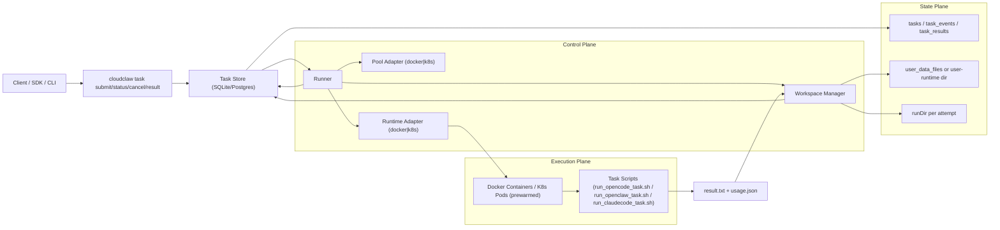
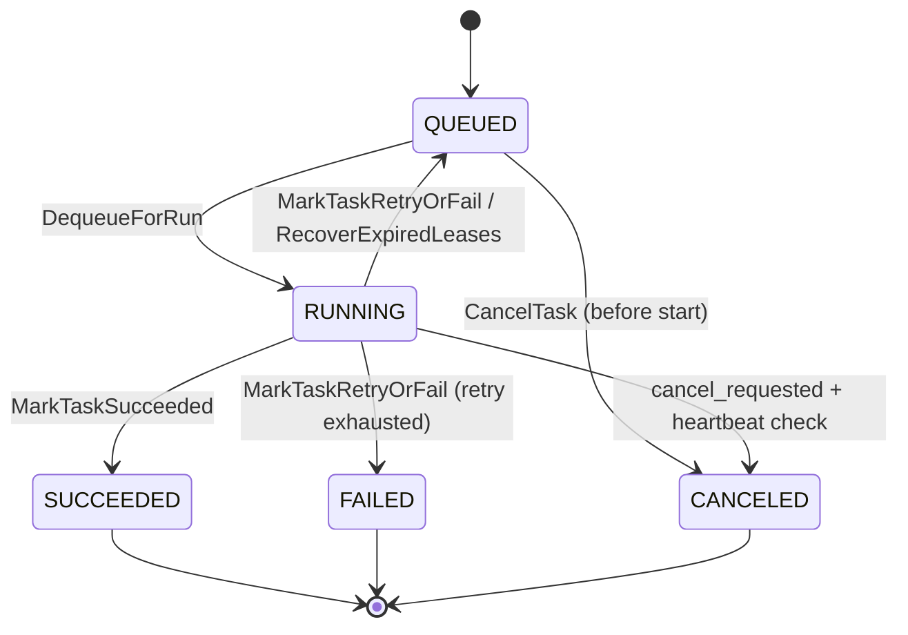

# CloudClaw 系统设计梳理（论文草稿）

## 0. 摘要（可直接放到论文）

CloudClaw 是一个面向 LLM Agent 任务执行的轻量级系统软件框架。系统采用“控制面-执行面-状态面”分层：控制面负责任务入队、调度与审计；执行面负责在 Docker/Kubernetes 运行时中执行任务；状态面负责用户工作区状态持久化与结果分发。  
核心创新在于把多租户安全隔离（用户级串行、工作区隔离、容器硬化）与可恢复调度（租约 + 心跳 + 失效回收 + 重试优先级）统一在一个可验证的执行闭环内，同时保留对多 Agent Runtime（OpenCode / OpenClaw / ClaudeCode）的统一抽象。  
该设计体现了系统领域关注的三个关键目标：隔离性（isolation）、可用性（availability）和可观测性（observability），并通过“运行时可插拔 + 使用量自适应估算 + 共享技能注入”体现智能化执行基础设施的特征。

## 1. 问题定义与设计目标

### 1.1 问题

在多用户共享 Agent 基础设施中，系统必须同时满足：

1. 任务并发执行与资源复用（提高吞吐）。
2. 用户状态隔离与跨任务连续性（避免状态污染）。
3. 执行失败可恢复（避免任务永久丢失）。
4. 对下游消费者稳定输出结果（可审计、可追踪）。

### 1.2 设计目标

1. **安全隔离**：用户状态与共享配置分离；最小权限运行容器。
2. **调度可靠**：分布式可恢复语义，支持 crash/restart 场景。
3. **运行时抽象统一**：同一调度框架支持 Docker/K8s 与多 Agent。
4. **工程可验证**：关键机制均有测试覆盖与审计日志。

## 2. 总体架构

### 2.1 分层架构图

### 2.2 控制流（简化）

1. 客户端提交任务，进入 `tasks` 队列（状态 `QUEUED`）。
2. Runner 为每个容器启动 worker，拉取可执行任务。
3. Workspace `Prepare` 恢复用户状态到本次 `runDir`。
4. Runtime Adapter 调用 Docker/K8s 在容器/Pod 中执行任务脚本。
5. 采集 `result.txt` 与 `usage.json`，Workspace `Persist` 回写状态。
6. Store 将任务置为终态，并写入 `task_results` 与 `task_events`。

### 2.3 任务状态机

## 3. 核心机制一：安全隔离

### 3.1 多租户并发隔离（用户级互斥）

调度 SQL 保证同一 `user_id` 在同一时刻最多一个 `RUNNING` 任务，避免同用户并发写同一状态目录，降低状态竞争与污染风险。  
该策略是软事务级隔离，不依赖外部分布式锁。

### 3.2 工作区隔离与最小共享面

1. 每次尝试使用独立 `runDir`（`taskID-attempt-N`）。
2. 共享技能目录可 `copy` 或 `mount`，并在持久化前清理不应进入用户快照的共享内容。
3. 用户运行时状态支持两种模式：
   - `db`：序列化进 `user_data_files`；
   - `ephemeral`：宿主 `user-runtime/<normalized_user>-<crc32>/<runtime>` copy-in/copy-out。

### 3.3 路径与数据安全

1. 持久化时拒绝符号链接、校验相对路径安全性（防目录穿越）。
2. 限制单文件大小与用户总大小（默认 32 MiB / 256 MiB）。
3. Docker `mount` 模式校验 `runDir` 必须在允许的 host base 下，阻断越界映射。

### 3.4 容器与权限硬化

部署脚本支持默认容器硬化：

1. `no-new-privileges`。
2. `cap-drop=ALL`。
3. `pids-limit`。
4. 可选只读根文件系统 + `tmpfs(/tmp,/var/tmp)`。
5. runner 镜像使用非 root 用户执行。
6. K8s RBAC 最小权限仅允许 `pods` 读与 `pods/exec`、`pods/attach`。

## 4. 核心机制二：任务调度与容错

### 4.1 调度策略

队列排序为 `priority ASC, enqueued_at ASC, created_at ASC`：  
`priority=0` 用于重试任务优先回补，`priority=1` 为普通任务，兼顾恢复速度与公平性。

### 4.2 租约 + 心跳

1. 任务出队时设置 `lease_until = now + lease_duration`。
2. 运行中周期性 `Heartbeat` 延长租约。
3. 心跳失败触发任务中断，避免幽灵执行。

### 4.3 失效恢复与重试

`recoveryLoop` 周期执行两件事：

1. `Pool.Reconcile()`：确认执行池健康。
2. `RecoverExpiredLeases()`：将租约过期任务回收到 `QUEUED`，并提升为重试优先级。

失败任务按 `max_retries` 执行有限次重试，超限后进入 `FAILED` 终态并产出结果记录。

### 4.4 取消语义与结果队列

1. `RUNNING` 任务通过 `cancel_requested` 协作取消。
2. `QUEUED` 任务可直接转 `CANCELED`。
3. `task_results` 通过 `delivered_at` 实现幂等出队，支持下游“拉取一次交付”。

### 4.5 调度器形式化约束（论文可用）

设任务集合为 `T`，任务 `t` 的用户为 `u(t)`，状态为 `s(t)`。  
系统满足约束：

`forall u, |{t in T | u(t)=u and s(t)=RUNNING}| <= 1`

并最小化目标：

`minimize sum_t completion_time(t) + lambda * retry_latency(t)`

其中 `retry_latency` 通过重试优先级机制被压低。

## 5. 核心机制三：智能化执行基础设施

### 5.1 运行时可插拔抽象

通过 `RuntimeAdapter` + `PoolAdapter` + `WorkspaceManager` 三接口解耦：

1. 同一 Runner 支持 Docker 与 K8s。
2. 同一调度面支持 OpenCode、OpenClaw 与 ClaudeCode 三类 Agent runtime。
3. 任务脚本可按 runtime 独立演进，不破坏调度核心。

### 5.2 共享技能注入

系统支持全局 `shared-skills` 注入到每个任务工作区，形成“策略先验 + 用户上下文”的执行组合，为智能体能力统一治理提供载体。

### 5.3 使用量自适应估算

优先读取 runtime 输出的 `usage.json`；若缺失则由输入/输出字符数估算 token。  
该回退机制保证计量链路稳健，即使上游 agent 未返回标准 usage 结构也不影响记账与统计。

## 6. 论文写作建议（Sys 方向）

### 6.1 可主打贡献点

1. **Practical Isolation for Agent Runtime**：在不引入重型编排系统的前提下实现用户状态隔离。
2. **Lease-based Recoverable Scheduling**：面向 agent 长任务的可恢复调度闭环。
3. **Unified Multi-runtime Execution Plane**：统一抽象下兼容多执行后端与多 agent 生态。

### 6.2 建议实验

1. 吞吐与时延：固定池大小下，任务并发从 10 到 1000。
2. 故障注入：随机 kill runner/容器，统计恢复成功率与恢复时延。
3. 隔离验证：构造跨用户同名文件、恶意路径、超限文件，验证防护有效性。
4. 重试策略收益：比较有无 `priority=0` 重试优先的尾延迟。

实验环境建议：

1. 低并发功能验证可用 SQLite。
2. 高并发压测（尤其并发 > 100）建议切换 PostgreSQL，避免 SQLite 写锁竞争影响吞吐与尾延迟。
3. 保持同一组实验固定数据库后端，避免跨后端结果不可比。

### 6.3 建议图表

1. 架构图（本文件 2.1）。
2. 任务状态机图（QUEUED -> RUNNING -> SUCCEEDED/FAILED/CANCELED）。
3. 故障恢复时序图（lease expire -> requeue -> re-exec）。
4. 安全边界图（host / runner / container / user-state）。

## 7. 代码实现锚点（可在论文中引用）

1. 调度主循环与恢复：`internal/core/runner.go`
2. 出队原子更新与同用户互斥：`internal/store/store.go` (`dequeueUpdateSQL`)
3. 租约/心跳/过期恢复：`internal/store/store.go` (`Heartbeat`, `RecoverExpiredLeases`)
4. 用户数据安全持久化：`internal/store/store.go` (`ReplaceUserDataFromDir`, `RestoreUserDataToDir`)
5. 工作区准备与持久化策略：`internal/workspace/local_manager.go`
6. Docker 路径边界校验：`internal/engine/docker_runtime_executor.go` (`layoutForMountedWorkspace`)
7. 容器硬化参数：`deploy/server/cloudclawctl.sh` (`CONTAINER_HARDEN`, `CONTAINER_READONLY_ROOTFS`)
8. 非 root runner 镜像：`deploy/server/templates/Dockerfile.runner`
9. K8s 最小权限样例：`deploy/k8s/cloudclaw-rbac.yaml`
10. 关键单测：
    - `internal/store/store_test.go`
    - `internal/workspace/local_manager_test.go`
    - `internal/engine/docker_runtime_executor_test.go`
    - `internal/core/runner_test.go`

## 8. 可直接复用的小结

CloudClaw 的系统设计本质上是一个“Agent 任务操作系统化”实践：  
它把任务调度、故障恢复、状态管理与执行隔离整合为统一控制面，并用可插拔运行时支撑智能体生态演进。对 sys 研究而言，其价值不在单点算法，而在工程可验证的端到端语义闭环。
